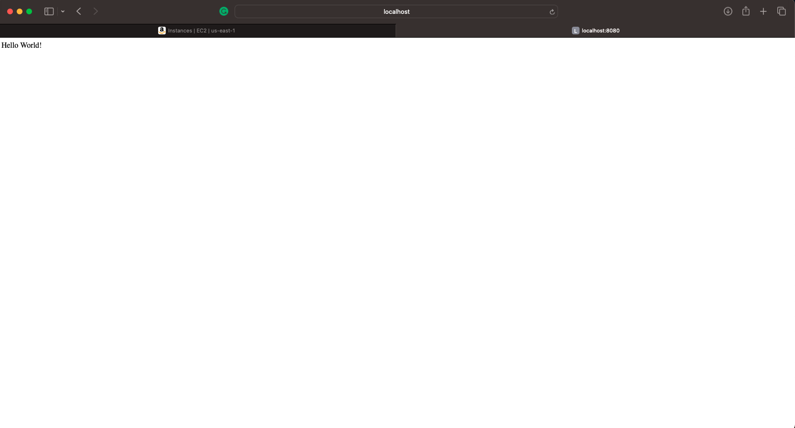

## Deploying an app to a VM

### Steps:

- Launch a VM through the Cloud Console (AWS, GCP or Azure).
- Deploy the node.js application provided in this folder on the VM.

1. 
2. Chmod to fix "Warning: unprotected Private Key File"

3. Ec2 connected with local machine:

4. Install Node version Manager (NVM).

5. Created a new directory - mkdir app

6. 